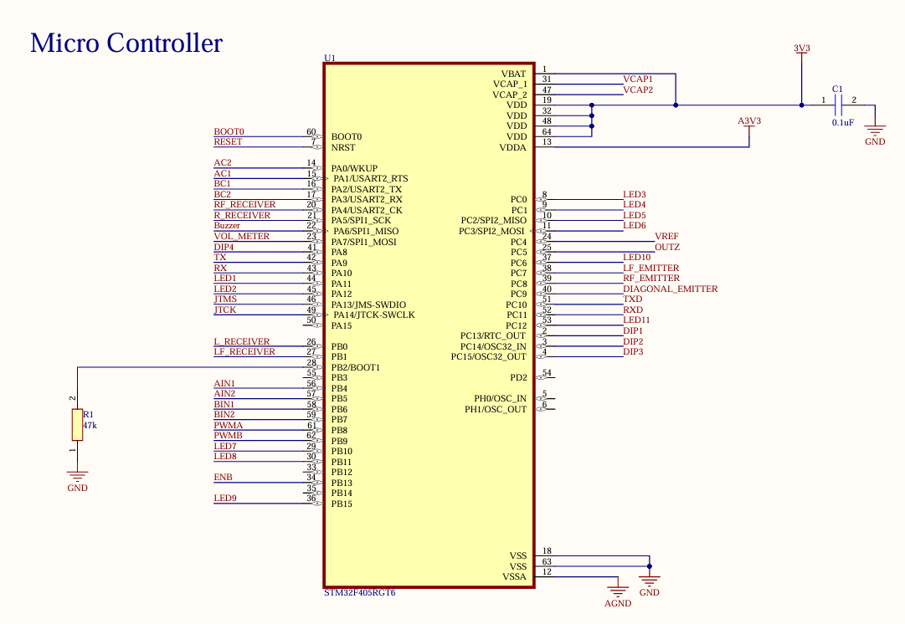
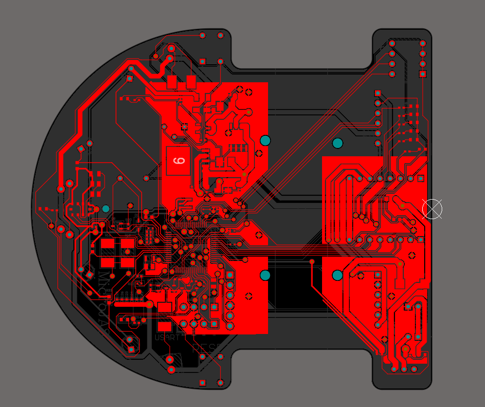
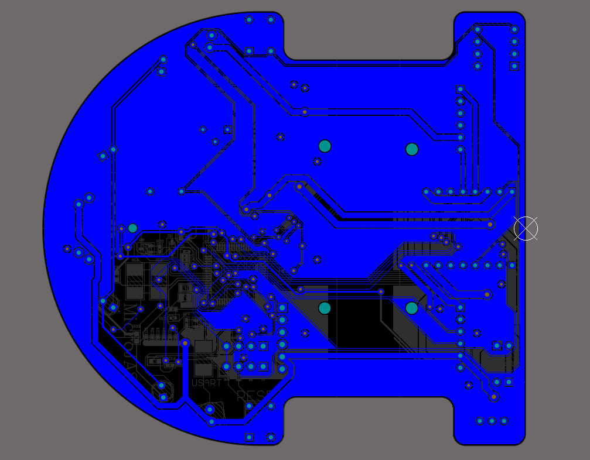
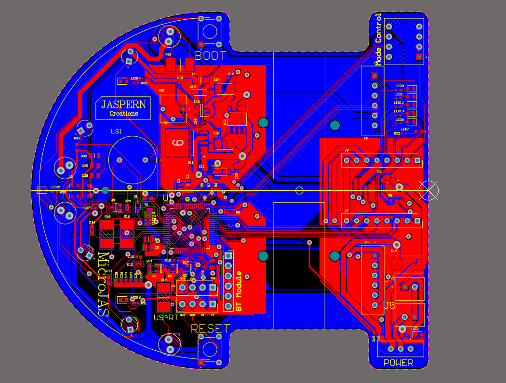
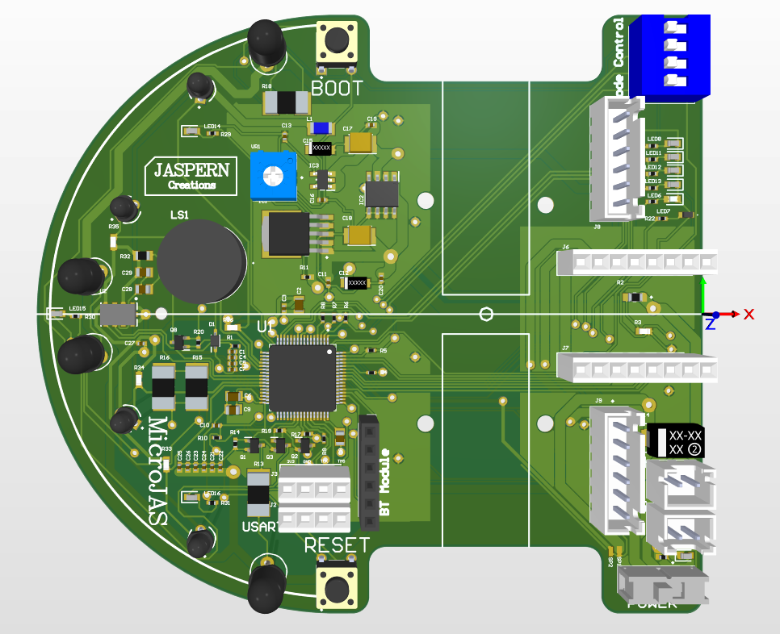

# 🤖 MicroJAS---Micromouse-Robot 🐭⚡

Welcome to the **MicroJAS Micromouse Robot Project**! 👋 MicroJAS is a compact and efficient micromouse robot designed to navigate mazes autonomously with precision and speed. This repository contains all the resources, code, and documentation needed to build and program MicroJAS. 💻📚

MicroJAS represents a commitment to continuous improvement, pushing the boundaries 🚀 of what a micromouse robot can achieve. From hardware design to algorithm optimization, each step aims to enhance its performance and reliability 🎯.

---

## 🧭 Table of Contents
1. [Overview](#overview)
2. [Features](#features)
3. [Components Used](#components-used)
4. [PCB Design](#pcb-design)
    - [Schematic Design](#schematic-design)
    - [PCB Layout](#pcb-layout)
5. [Software](#software)
6. [How to Build](#how-to-build)
7. [How to Use](#how-to-use)
8. [Gallery](#gallery)
9. [Contributing](#contributing)
10. [License](#license)

---

## 💡 Overview

The **MicroJAS Micromouse Robot** is a high-performance robotic solution designed to autonomously navigate and solve mazes with precision and efficiency. Our primary focus was to build a more efficient micromouse by integrating a custom-designed PCB, advanced sensors, and a robust codebase.

---

## ✨ Features

- ✅ **Compact and Optimized Design**
- ✅ **Advanced Motion Control**
- ✅ **High-Accuracy Sensing**
- ✅ **Reliable Power Management**
- ✅ **Intelligent Algorithms**
- ✅ **Dynamic Adaptability**
- ✅ **Robust Communication and Diagnostics**
- ✅ **Sustainable and Scalable**

---

## 🛠️ Components Used

| Component                  | Description                                                                                                                                                                                            |
|----------------------------|--------------------------------------------------------------------------------------------------------------------------------------------------------------------------------------------------------|
| **STM32F405RGT6**          | The STM32F405RGT6 is a high-performance microcontroller from STMicroelectronics. It is based on the **ARM Cortex-M4 core**, featuring a **168 MHz** CPU, **1 Mbyte** of Flash memory.                  |
| **MIC29302AWD**            | The MIC29302AWD is a low dropout (LDO) voltage regulator from Microchip Technology. It provides a stable output voltage of **3.3V** with a current output of up to **2A**.                             |
| **MIC39101-5.0YM**         | The MIC39101-5.0YM is a low dropout (LDO) voltage regulator from Microchip Technology. It provides a stable output voltage of **5.0V** with a current output of up to **1A**.                             |
| **TPS73633MDBVREP**        | The TPS73633MDBVREP is a low dropout (LDO) voltage regulator from Texas Instruments. It provides a fixed output voltage of **3.3V** and can deliver a current of up to **400mA**.                      |
| **SFH_4545**               | The SFH_4545 is a high-intensity infrared (IR) LED from OSRAM. It is designed to emit infrared light at a wavelength of around 950 nm with a higher radiant intensity, making it suitable for applications requiring strong and focused IR light output. |
| **TEFT4300**               | The TEFT4300 is a high-performance phototransistor from Vishay, designed for optical sensing applications. It is sensitive to infrared light with a peak wavelength of around **950 nm**.               |
| **LY3200ALH**              | The LY3200ALH is a MEMS (Micro-Electromechanical Systems) gyroscope sensor manufactured by STMicroelectronics. It is a high-performance, **±2000 degrees per second (dps)** analog yaw-rate gyroscope that measures angular velocity around a single axis. |
| **TB6612FNG**              | The TB6612FNG is a dual H-bridge motor driver. It is designed to control DC motors. It supports a supply voltage range of **4.5V to 13.5V** and can provide up to **1.2A** of continuous current per channel, with a peak current capability of **3.2A**. |
| **N20 Motors With Encoders** | The N20 motors with encoders are small, high-torque DC motors typically used in robotics and embedded systems. These motors come equipped with an integrated encoder that provides feedback on the motor’s position and speed, enabling precise control of rotation.     |

---
## 🖥️ PCB Design 📐
---
### 📝 Schematic Design
The schematics for the MicroJAS Micromouse Robot were meticulously crafted using Altium Designer, a professional-grade PCB design tool. The schematics include all essential components, connections, and subsystems, ensuring a robust and efficient design.

This photo is an example image of schematics (Microcontroller).
This repository contains the full schematic PDF.

  

### 🖼️ PCB Layout

**PCB - Top Layer**

  

**PCB - Bottom Layer**

  

**PCB - All Layers**

  

**PCB - 3D model**

  

---
